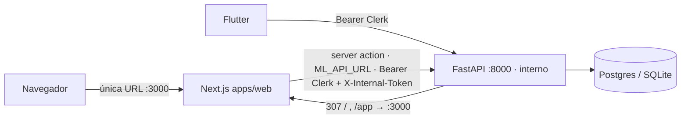

# Axis — Arquitectura

## Componentes

- **`apps/mobile/`** (Flutter): cámara, captura, UI de resultados, export PDF/JSON, i18n.
- **`apps/ml-api/`** (FastAPI): API SaaS principal con auth, cuotas, observabilidad y pipeline OpenCV + CNN-1D.
- **`ml/`** (Python): paquete `heartscan_ml` con entrenamiento PTB-XL y un API ligero alternativo.
- **`apps/web/`** (Next.js + Clerk + Supabase): **la única URL de cara al usuario**
  (landing + producto). El análisis se hace en un *server action* que llama al ML
  API con el JWT de Clerk.
- **`web_public/`** (HTML estático): consola/landing heredada. Con
  `HEARTSCAN_WEB_APP_URL` configurado, el FastAPI redirige `/`, `/app`,
  `/faq.html` a la app Next.js → no es superficie de usuario.
- **`infra/`** (Docker Compose): orquestación local (Postgres + API).

## Endpoints públicos del FastAPI

- `GET /health` — liveness simple.
- `GET /api/v1/meta` — versión de pipeline y modelo (público; consumido por la SPA).
- `POST /api/v1/auth/{register,login,me}` — JWT HS256 legacy, sólo si `HEARTSCAN_AUTH_LEGACY_ENABLED=true` (dev/tests).
- `POST /api/v1/analyze` — multipart. Auth: **Clerk Bearer** (verificado vía JWKS) — el camino del producto — o `X-API-Key` legacy (dev). Tenant por organización Clerk o, en modo org-opcional, `clerk-user:`. Validación por magic bytes y cuota diaria.
- `POST /api/v1/reports/pdf` — informe a partir de un `AnalysisResponse` previo.
- `GET /api/v1/education` — contenido educativo (i18n).
- `GET /metrics` — métricas Prometheus.

Paridad de respuestas con el paquete ML: [`docs/API_PARITY.md`](API_PARITY.md).

## Flujo de análisis

1. Imagen JPEG/PNG/WebP → validación magic bytes → escala de grises → supresión de cuadrícula → binarización.
2. Extracción de serie 1D por columna (`trace_extract`).
3. *Quality gate* ([`docs/algorithms/quality_gate.md`](algorithms/quality_gate.md)): si la extracción es pobre, la clase efectiva se acota sin confiar en CNN.
4. Picos R aproximados → intervalos R-R y regularidad.
5. CNN-1D sobre señal remuestreada → `normal | arrhythmia | noise`.
6. Composición de `AnalysisResponse` con `status` (`green|yellow|red`), mensaje localizado y disclaimer.

## Operación

- Documentación de ejecución local y E2E entre clientes: [`docs/E2E_CLIENTS.md`](E2E_CLIENTS.md), [`README.md`](../README.md).
- Configuración: [`apps/ml-api/.env.example`](../apps/ml-api/.env.example), [`infra/.env.example`](../infra/.env.example), [`apps/web/.env.example`](../apps/web/.env.example).
- Sistema visual y UX: [`docs/UI_DESIGN_SYSTEM.md`](UI_DESIGN_SYSTEM.md).
- Seguridad: [`docs/SECURITY_PROGRAM.md`](SECURITY_PROGRAM.md), [`docs/SECURITY_CVE.md`](SECURITY_CVE.md).
- Observabilidad y beta: [`docs/OBSERVABILITY.md`](OBSERVABILITY.md), [`docs/BETA_SHIPPING.md`](BETA_SHIPPING.md).
- ADRs: [`docs/adr/`](adr/).

## Límites del producto

- Una foto de tira ≠ ECG clínico de 12 derivaciones.
- BPM absoluto requiere escala temporal; si no es trazable, `bpm` es `null` y se indica `non_reportable_reason`.
- Producto **informativo y educativo**; ver [`docs/legal/DRAFT_NOTICE.md`](legal/DRAFT_NOTICE.md).
