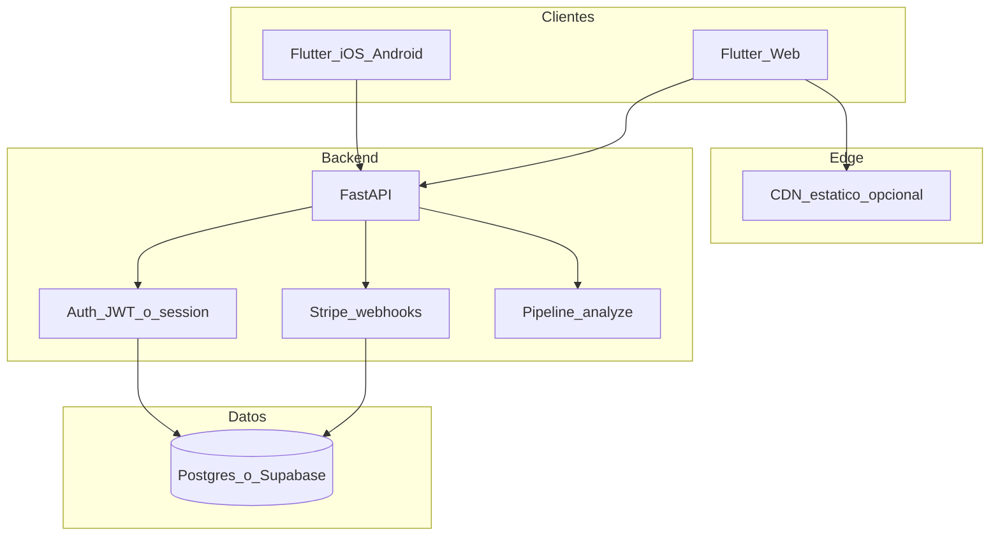

# HeartScan — Plan SaaS + aplicación web

## Objetivo

Ofrecer **HeartScan como producto SaaS**: web responsive accesible desde navegador, con camino claro hacia **autenticación**, **planes de pago** y **límites de uso**, manteniendo el mismo backend FastAPI y reutilizando el cliente **Flutter** (iOS/Android/Web desde un solo código).

## Arquitectura objetivo

## Fases

### Fase A — Web + demo local (ahora)

- Habilitar **Flutter Web** (`web/`).
- **Landing** pública (marketing + disclaimer médico) y **ruta de app** (`/app`) para el flujo de análisis.
- En web: **subida de imagen** por selector de archivos (sin `camera` nativa); en móvil se mantiene cámara.
- CORS y `HEARTSCAN_API_BASE` apuntando al API local.
- Script `scripts/run_local.sh` que levanta API + indica comando Flutter Chrome.

### Fase B — SaaS mínimo viable

- **Cuentas de usuario**: email/contraseña o OAuth (p. ej. Clerk, Supabase Auth, Auth0) — una decisión por ADR.
- **Organización/workspace** opcional (B2B médico más adelante).
- **API keys** por usuario o **JWT** de sesión en lugar de una sola clave compartida.
- **Cuotas**: análisis/mes por plan (tabla en DB + middleware).

### Fase C — Facturación

- **Stripe**: Productos `Free`, `Pro`, `Team`; **Customer Portal**; **webhooks** `checkout.session.completed`, `customer.subscription.updated`.
- Estados de suscripción en DB; feature flags en API (`plan: free|pro`).

### Fase D — Operación

- Dominio propio, HTTPS, secretos en vault.
- Observabilidad (ya hay `/metrics`), alertas, backups DB.

## Decisiones de producto (SaaS)

| Tema | Recomendación |
|------|----------------|
| Modelo Free | N análisis/día con marca de agua en PDF opcional o límite de tamaño |
| Pro | Mayor cuota, exportación avanzada, historial (si se almacena con consentimiento) |
| Datos | Por defecto **no** guardar imágenes; historial solo si el usuario activa “guardar en la nube” + consentimiento |

## Stack concreto (alineado con el repo actual)

- **Frontend**: Flutter (Web + mobile) — una base de código.
- **Backend**: FastAPI existente; ampliar con módulos `auth/`, `billing/` cuando entre Fase B/C.
- **DB**: Supabase o Postgres + SQLAlchemy (siguiente iteración).

## Criterios de “listo” para Fase A

- `flutter run -d chrome` con landing + upload + resultados contra API local.
- README con pasos de un solo comando o script documentado.
